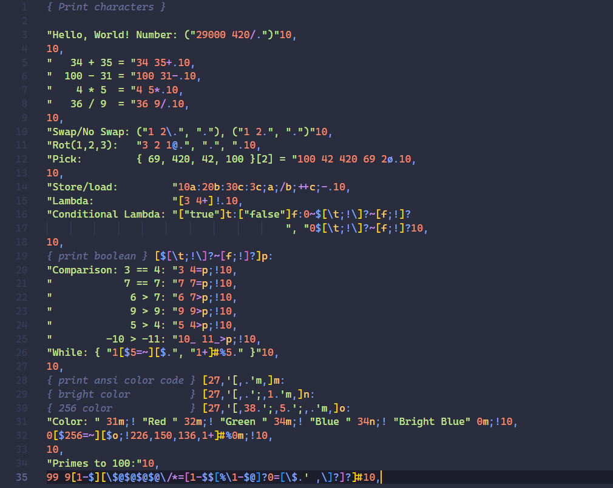

# false README

This is a language extension for the language "FALSE", more on the website [strlen.com/false-language](https://strlen.com/false-language/).

I have also written an interpreter and compiler in .NET, which can be found here: [github.com/MixusMinimax/falsedotnet](https://github.com/MixusMinimax/falsedotnet)

## Features

FALSE Syntax highlighting.

## Release Notes

Users appreciate release notes as you update your extension.

### 0.0.1

Initial release of the FALSE language extension
